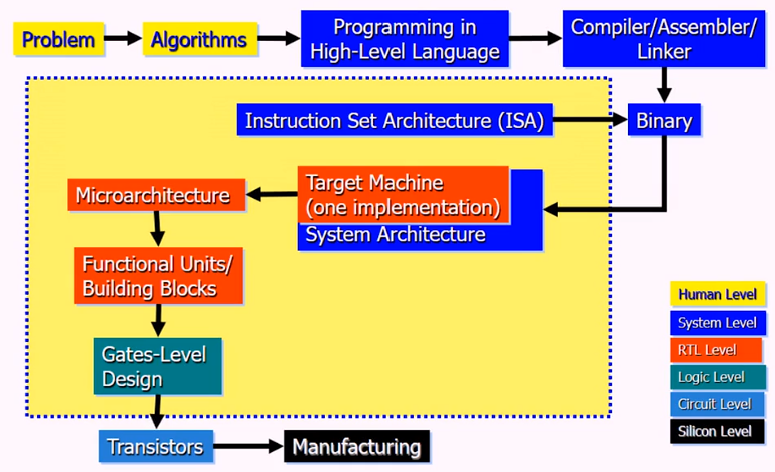

# Week 1 Fundamentals of Quantitative Design and Analysis
## Table of Contents
- **&rarr;[Week 1 Fundamentals of Quantitative Design and Analysis](README.md)**
- [Week 2 Processor Design](../week2/README.md)
- [Week 3 Advanced Pipelining and I/O](../week3/README.md)
- [Week 4 Memory Hierarchy Design](../week4/README.md)
- [Week 5 Instruction-Level Parallelism (ILP)](../week5/README.md)
- [Week 6 Vector and GPU Architectures (DLP)](../week6/README.md)
- [Week 7 Multithreaded and Multicore Processors (Thread-Level Parallelism)](../week7/README.md)
- [Week 8 Shared-Memory Systems (Data-Level Parallelism)](../week8/README.md)
- [Week 9 Interconnection Networks](../week9/README.md)
- [Week 10 Request-Level Parallelism](../week10/README.md)

### Then and Now
- Fundamentals and Performance Analysis
- Building Blocks
- Logic design conventions
- building a datapath
- a simple implementation
- an overview of pipelining
- pipelined datapath and control

Main objective
- attain a strong foundation to understand an analyze computer architecture and to apply these insights and principles to future computer designs

### Design Flow

#### Requirements to Implementation

- application requirements -> technology constraints
  - abstraction layers need to close the gap
  - computer architects are in between
    - feedback to application and technology directions
- computer architecture is the development of the abstraction/implementation layers that allow us to:
  - execute information-processing applications efficiently using available manufacturing technologies

#### Abstraction Hides Complexity

#### Hierarchy of Computation

#### Methodology is Key

- architecture
  - hardware
    - processors
  - software
    - processes
- applications
  - requirements
  - specifications
  - platforms
- methodologies
  - modeling
  - analysis
  - synthesis
  - verification

#### Models to Architectures
- models
  - conceptual views of system functionality
  - a set of objects and rules for choosing the objects
- architectures
  - abstract views of system implementation
  - a set of implementation components and their connections
- computer architecture
  - the process of building computing systems to meet given application requirements within physical technology constraints

### Classes of Computers

- personal mobile devices
- desktop computing
- servers
- clusters/warehouse scale computers
  - saas
- embedded computers

#### Parallelism
- classes of parallelism in applcaiotns
  - data-level parallelism (DLP)
  - task-level parallelism (TLP)
- classes of architectural parallelism
  - instruction-level parallelism
  - vector architectures/graphic processor units (GPUs)
  - thread-level parallelism
  - request level parallelism

#### Flynn's Taxonomy

- single instruction stream, single data stream (SISD)
- single instruction stream, multiple data streams (SIMD)
  - vector architectures
  - multimedia extensions
  - graphics processor units
- multiple instruction streams, single data stream (MISD)
  - no commercial implementation
- multiple instruction streams, multiple data streams (MIMD)
  - tightly coupled MIMD
  - loosely coupled MIMD

#### Defining Computer Architecture

- Old view
  - instruction set architecture ISA design
  - decisions regarding:
    - registers, memory addressing, addressing modes, instruction operands, available operations, control flow instructions, instruction encoding
- Real computer architectures
  - specific requirements of the target machine
  - design to maximize performance within constraints: cost, power, availability
  - includes ISA, microarchitecture, hardware

### Trends in Technology

- integrated circuit technology
  - transistor density: 35 %/year
  - die size: 10-20 %/year
  - integration overall: 50-55 %/year
- DRAM capacity 25-40 percent/year
- Flash Capacity: 50-60 percent/year
  - 15-20x cheaper/bit than DRAM
- Magnetic disk technology: 40 %/year
  - 15-25x cheaper/bit than flash
  - 300-500x cheaper/bit than DRAM

#### Bandwidth and Latency
- bandwidth or throughput
  - total work done in a given time
  - 10000-25000x improvement for processors
  - 300-1200x improvement for memory disks

- latency or response time
  - time between start and completion of an event
  - 30-80x improvement for processor 
  - 6-8x improvement for memory and disks

#### Transistors and Wires

- Feature size
  - minimum size of transistor or wire in x or y dimension
  - 10 microns in 1971 to 0.01 microns (10 nm) in 2017
    - 5 nm in 2021
  - transistor performance scales linearly
    - wire delay does not improve with feature size
  - integration density scales quadratically
    - 2,300 in 1971 to 30,000,000,000 in 2017

#### Trends in Energy, Power, and Cost

Power and Energy

- power = energy/second = energy/op x ops/second
- power
  - chip packaging
  - system noise
  - chip and system cooling
- Energy
  - joules per task
  - battery life
  - electricity bill
  - device weight

- problem, get power in, get power out
- thermal design power (TDP)
  - characterizes sustained power consumption
  - used as target for power supply and cooling system
  - lower than peak power, higher than average power consumption
- clock rate can be reduced dynamically to limit power consumption
- energy per task is often a better measurement

#### Dynamic Energy and Power

- dynamic energy 
  - transistor from 0&rarr;1 or 1&rarr;0
  - 1/2 x capacitive load x voltage^2
- dynamic power
  - 1/2 x capacitive load x voltage^2 x frequency switched
- reducing clock rate reduces power, not energy

#### Reducing Power

- power for reducing power
  - do nothing well
  - dynamic voltage-frequency scaling
  - low power state for DRAM disks
  - overclocking, turning off cores

#### Static Power
- because leakage current flows even when a transistor is off, now static power is important too
  - current_static x voltage
  - scales with number of transistors
  - leakage current increases in processor with smaller transistor sizes
  - goal for leakage is 35 percent of total power consumption
- to reduce: power gating

#### Trends in Cost
- cost driven down by learning curve
  - yield
- DRAM: price closely tracks cost
- microprocessors: price depends on volume
  - 10 percent less for each doubling of volume

#### Integrated Circuit Cost

- Bose-Einstein formula

#### Principles

- take advantage of parallelism
  - eg multiple processors, disks, memory banks, pipelining, multiple functional units
- principle of locality
  - reuse of data and instructions
- focus on the common case
  - amdahl's law

- processor performance equation

> instructions/program X clock cycles/instruction X seconds/clock cycle = seconds/program = CPU time

#### Crossroads

- old: power is free; transistors expensive
  - new: power wall; power expensive, transistors free

## Live Session

Assignments 2, 4 and the final are difficult.

- Deadlines are deadlines!

### Outline

- quantitative principles of design
  - take advantage of parallelism
  - principle of locality
  - focus on the common case
  - amdahls law
  - the processor performance equation

#### Take advantage of parallelism

- increasing throughput of server computer via multiple processors or multiple disks
- pipelining: overlap instruction execution to reduce the total time to complete an instruction sequence
  - classic 5-stage pipeline
    - insctin fetch (Ifetch)
    - register read (reg)
      - decode
    - execute (ALU)
      - arithmetic and logic unit
    - data memory access (Dmem)
      - load or store
      - load: **copy from memory and put it in a register**
      - store: **copy from register and place in the memory**
    - Register write (reg)
      - write the value to the register

> instruction: add R1 R2 R3
> - R2+R3 put into R1

- cannot use two pieces of hardware at the same time

- separate I & D
  - instruction
  - data

- bus is a channel from the memory to the data

- cache memory is something in between the CPU and Memory
  - off the chip
    - memory is far from the CPU
  - cache is nearby and on the chip
    - cache is way less than the large memory
    - speed is amazing
    - size is bad

> if a CPU wants to access a byte, we will give the CPU the block that contains that byte

- we only access blocks in memory, not words and bytes!

#### 3) Focus on the common case

#### 4) Amdahl's Law

1/(.4+(.4/10))

871 dies per wafer
