# Week 2 Processor Design
## Table of Contents
- [Week 1 Fundamentals of Quantitative Design and Analysis](../week1/README.md)
- **&rarr;[Week 2 Processor Design](README.md)**
- [Week 3 Advanced Pipelining and I/O](../week3/README.md)
- [Week 4 Memory Hierarchy Design](../week4/README.md)
- [Week 5 Instruction-Level Parallelism (ILP)](../week5/README.md)
- [Week 6 Vector and GPU Architectures (DLP)](../week6/README.md)
- [Week 7 Multithreaded and Multicore Processors (Thread-Level Parallelism)](../week7/README.md)
- [Week 8 Shared-Memory Systems (Data-Level Parallelism)](../week8/README.md)
- [Week 9 Interconnection Networks](../week9/README.md)
- [Week 10 Request-Level Parallelism](../week10/README.md)

### Building Blocks

Three Building Blocks

- computation
  - processor
- communication
  - network
    - input data
    - output data
- storage
  - memory

#### First a simple processor

- cpu performance factors
  - instruction count
    - determined by ISA and compiler
    - CPI and cycle tie
      - determined by CPU hardware
- we will examine two implementations
  - a simplified version
  - a more realistic pipelined version
- simple subset, shows most aspects
  

#### Instruction Execution

- PC -> instruction memory, fetch instruction
- register numbers -> register file, read registers
- depending on instruction class
  0 use ALU to calculate
    - arithmetic result
    - memory address for load/store
    - branch target address
  - access data memory for load/store
  - PC <- target address or PC + 4

#### CPU Overview

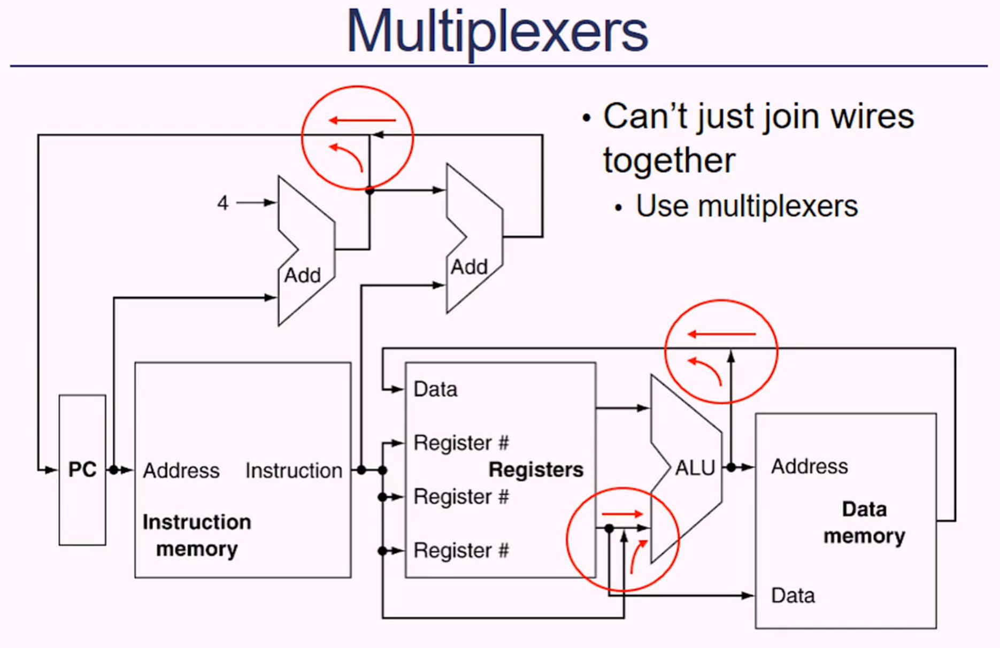

#### Control

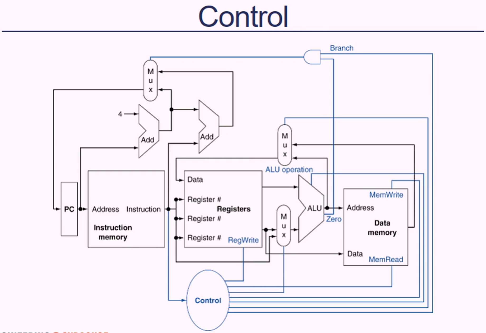

### Logic Design Conventions

#### Logic Design Basics

- Information encoded in binary
  - low voltage = 0, high voltage = 1
  - one wire per bit
  - multibit data encoded on multiwire buses
- combinational element
  - operate on data
  - output is function of input
- state (sequential elements)
  - current input and previous state matter
  - store information

#### Combinational Elements

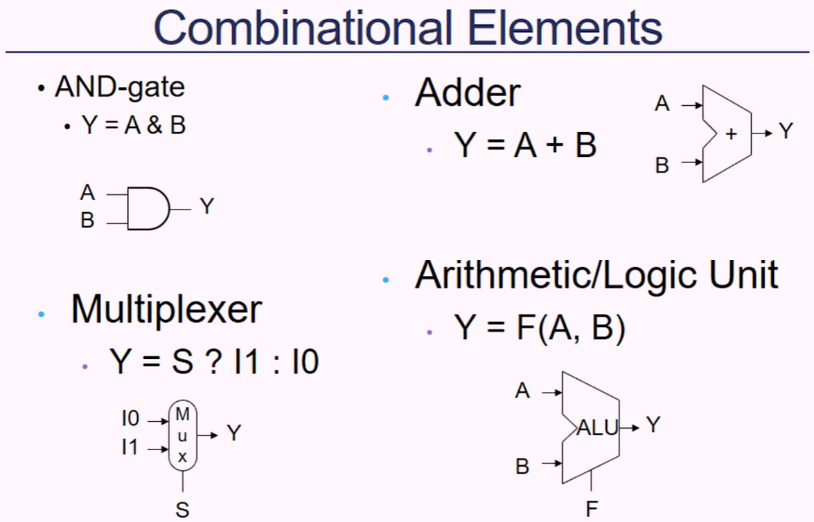

RTL - register transfer language

#### Sequential Elements

- register: stores data in a circiut
  - uses a clock signal to determine when to update a stored value
  - edge triggered: updates when Clk changes from 0 to 1

#### Clocking Methodology

- combinational logic transforms data during clock cycles
  - between clock edges
  - input from state elements, output to state element
  - longest delay determines clock period

### Building a Datapath

- datapath
  - elements that process data and addresses in the CPU
    - registers, ALUs, muxs, memories
- we will build a Av8 datapath incrementally
  - refining the overview design

#### Instruction Fetch

#### R-Format Instructions

- read two register operands
- perform arithmetic/logical operation
- write register results

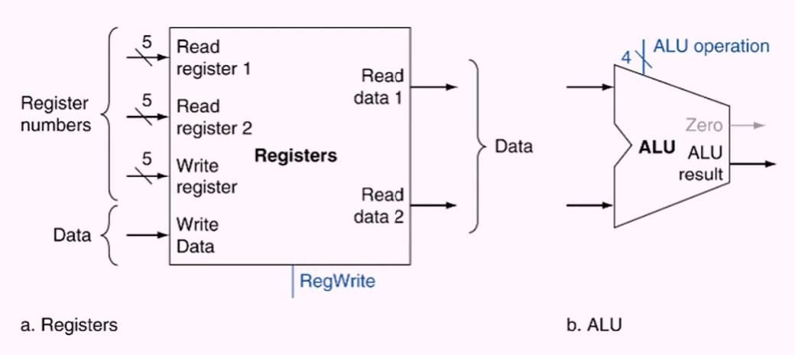

#### Load/Store Instructions

- read register operands
- calculate address using 16-bit offset
  - use ALU, but sign-extend offset
- load: read memory and update register
- store: write register value to memory

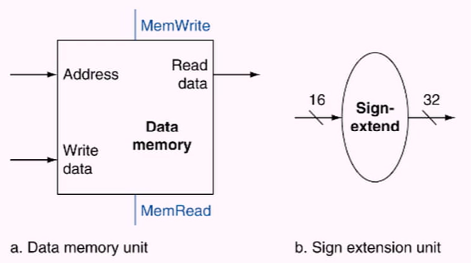

#### Branch Instructions

- read register operands
- compare operands
  - use ALU substract and check Zero output
- caclulate target address
  - sign-extend displacement
  - shift left two places (word displacement)
  - add to PC +4
    - already calculated by instruction fetch

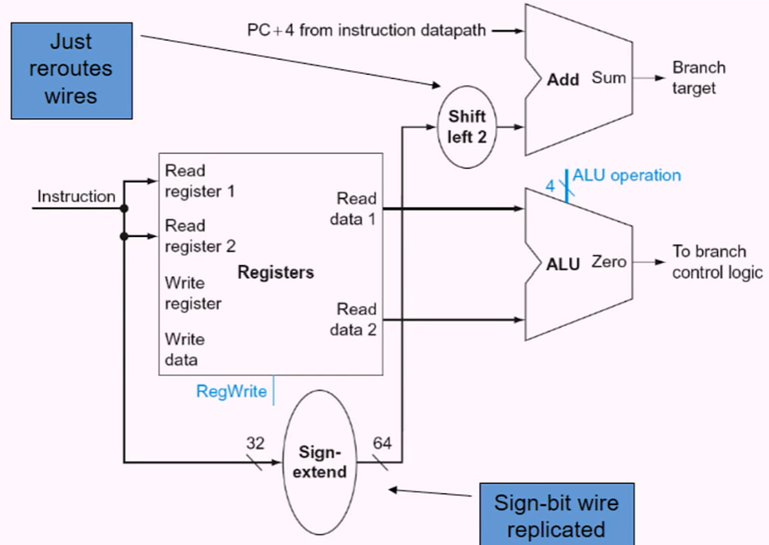

#### Composing the Elements

- first-cut datapath does an instruction in one clock cycles
  - each datapath element can do only one function at a time
  - hence, we need separate instructions and data memories
- use multiplexers where alternative data sources are used for different instructions

#### R-Type/Load/Store Datapath

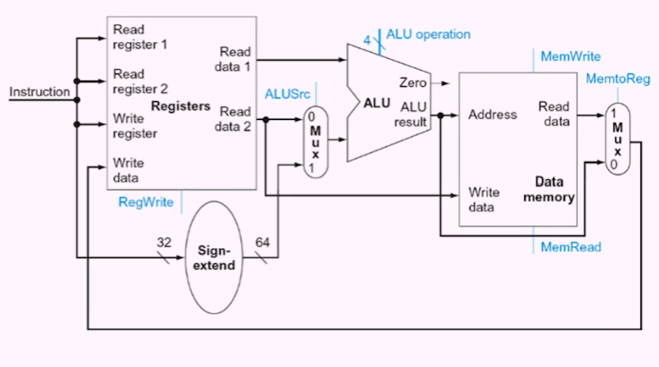

#### Full Datapath

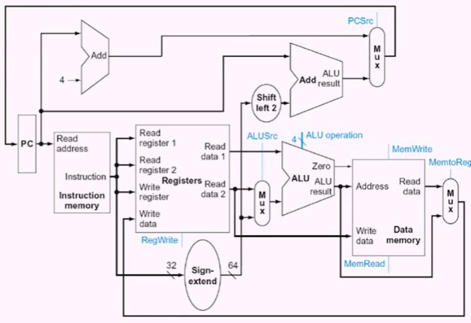

### A Simple Implementation

#### ALU Control

- ALU used for:
  - load/store: F = add
  - Branch: F = subtract
  - R-type: F depends on opcode

- Assume two-bit ALUOp derived from opcode.
  - Combinational logic derives ALU control

#### Main Control Unit

- control signals derived from instruction

#### Datapath with control

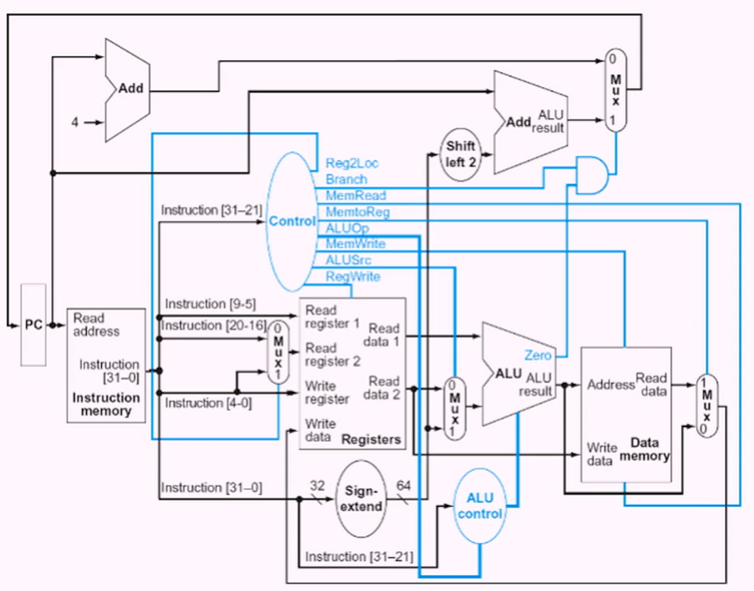

#### R-type Instruction

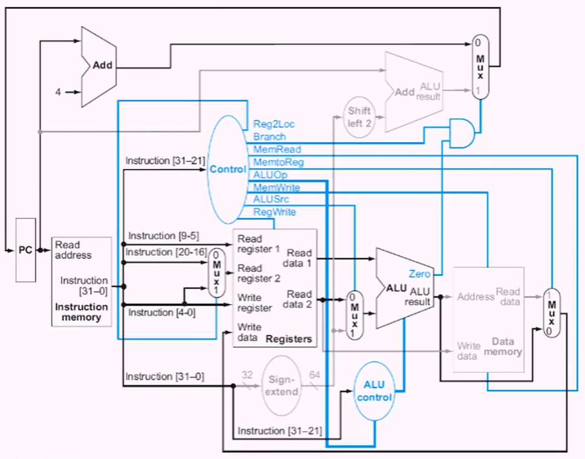

#### Load Instruction

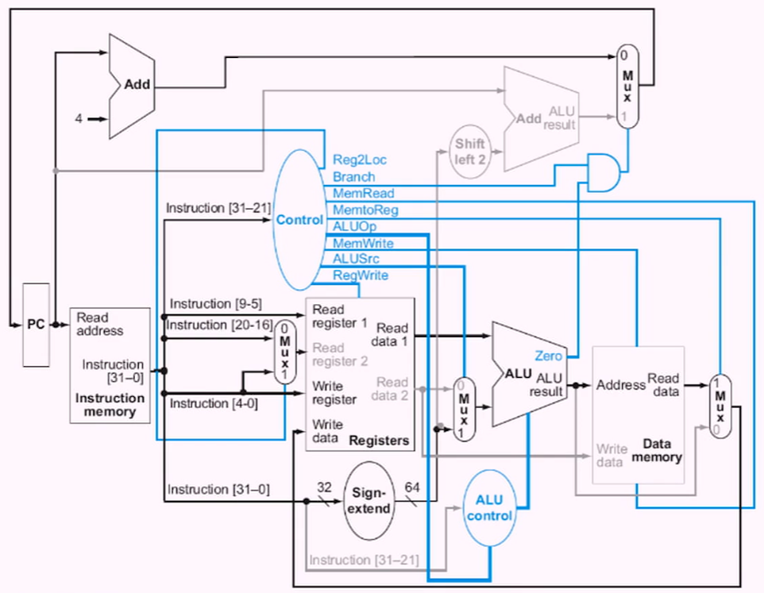

#### CBZ Instruction

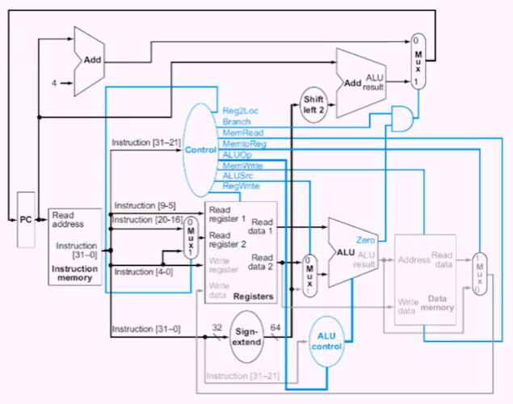

#### Implementing Conditional Branch

- jump uses word address
- update PC with concatenation of:
  - top four bits of old PC
  - 26-bit jump address
  - 00
- need an extra control signal decoded from opcode

#### Datapath with B added

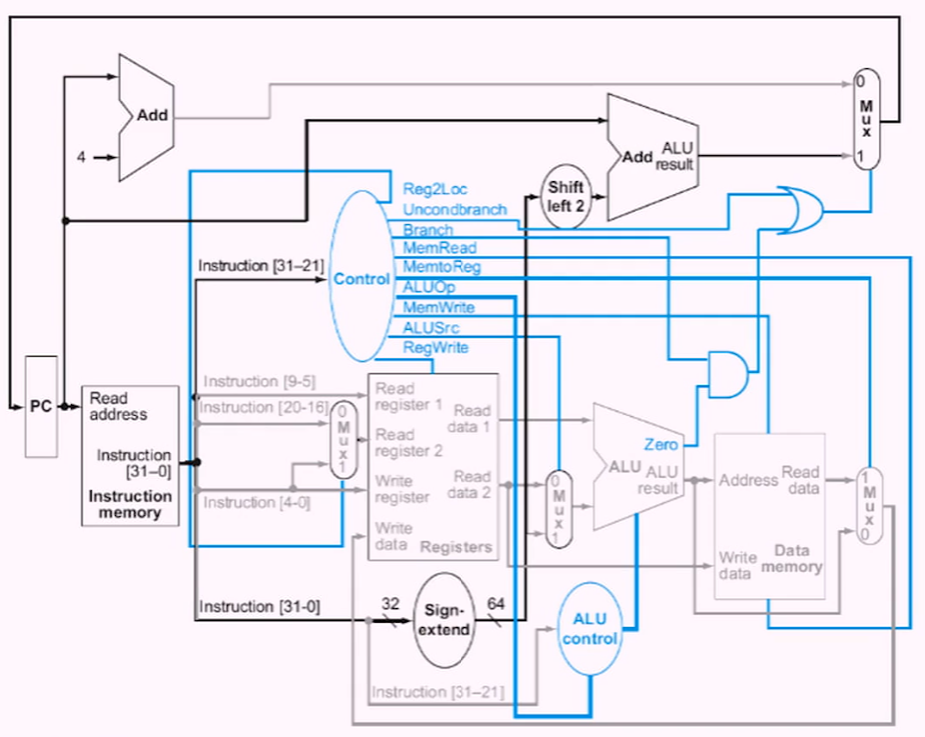

#### Performance Issues

- longest delay determines clock period
  - critical path: load instruction
  - instruction memory-> register file _> ALU -> data memory -> register file
- not feasible to vary period for different instructions
- violates design principle 
  - making the common case fast
- we will improve performance by pipelining

- CPU time = IC. CPI. CTT
- MIPS= (IC/CPU time in seconds) X 10^-6

### Pipelining

- pipelined laundry: overlapping execution
- parallelism improves performance.

#### AV8 Pipeline

- Five stages:
  - IF: instruction fetch from memory
  - ID: instruction decode and register read
  - EX: execute operation or calculate address
  - MEM: access memory operand
  - WB: writ result back to register

#### Pipeline Performance

- assume time for stages isL
  - 100ps for register read or write
  - 200ps for other states
- compare pipelined datapath with single-cycle datapath.

#### Pipeline Speedup

- if all stages are balanced
  - ie all take the same time
  - time between instructions_pipelined = 
  - = time between instructions_pipelined / # of stages
- if not balanced, speedup is less
- speedup due to increased throughput
  - latency (time for each instruction) does not decrease

#### Pipelining and ISA Design

- Av8 ISA designed for pipelining
  - all instructions are 32 bit
    - easier to fetch and decode in one cycle
  - few and regular instruction formats
    - can decode and read registers in one step
  - load/store addressing
    - can calculate address in third stage, access memory in fourth stage
  - alignment of memory operands
    - memory access takes only one cycle

### Pipelining Hazards

- Situations tht preent starting the next instruction in the next cycle
- structure hazards
  - a required resource is busy
- data hazard
  - need to wait for previous instruction to complete its data read/rewrite
- control hazard
  - deciding on control action depends on previous instruction

#### Structure hazards

- conflict for use in hardware
- more hardware

#### Data hazards

- an instruction depends on completion of data access by a previous instruction

#### Forwarding (bypassing)

- use result when it is computed
  - don't wait for it to be stored in a register
  - requires extra connections in the datapath

#### Load-Use Hazards

- can't always avoid stalls by forwarding
  - if value not computed when needed
  - can't forward back in time

#### Code Scheduling to Avoid Stalls
- reorder code to avoid use of oad result in next instruction
- C code for A=B+E; C=B+F

#### Control Hazards

- branch determines flow of control
  - fetch next instruction depends on branch outcome
  - pipelining cant always fetch correct instruction
    - still working on ID stage of branch
- In Av8 pipeline:
  - need to compare registers and compute target early in the pipeline
  - add hardware to do it in ID stage

#### Branch Prediction

- longer pipelines can't readily determine branch outcome early
  - stall penalty becomes unacceptable
- predict outcome of branch
  - only stall if prediction is wrong
- in Av8 pipeline:
  - can predict branches not take
  - fetch instructions after branch with no delay

#### More Realistic Branch Prediction

- static branch prediction
  - based on typical branch behavior
  - example: loop and if-statement branches
    - predict backward branches taken
    - predict forward branches not taken
- dynamic branch prediction
  - hardware measures actual branch behavior
    - eg record recent history of each branch
  - assume future behavior will continue the trend
    - when wrong, stall while fetching, and update history

#### Pipelining Summary

- pipelining improves performance by increasing instruction throughput
  - executes multiple instructions in parallel
  - each instruction has the same latency
- subject to hazards
  - structure, data, control
- instruction set design affects complexity of pipeline implementation

### Pipelined Datapath

#### pipeline registers
- Need registers between stages
  - to hold information produced in previous cycle

#### Pipeline operation

- cycle by cycle flow of instructions through the pipelined datapath
  - single-clock-cycle pipeline diagram
    - shows pipeline usage in a single cycle
    - highlight resources used
  - c.f. multi-clock-cycle diagram
    - graph of operation over time
- we'll look at single-clock-cycle diagrams for load and store

### Pipelined Control

#### Multicycle Pipeline diagram
- form showing resource usage
- traditional form

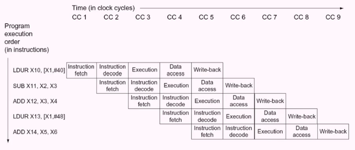

#### Single-Cycle Pipeline diagram

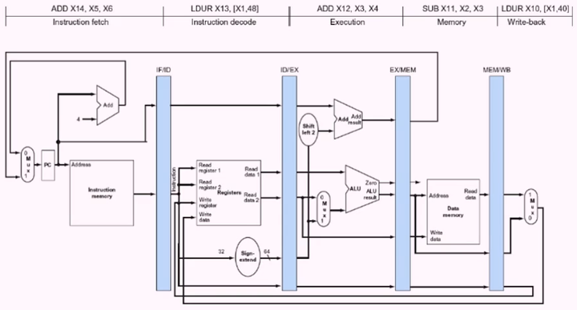

#### Pipelined Control

- control signals derived from instruction
  - as in single-cycle implementation

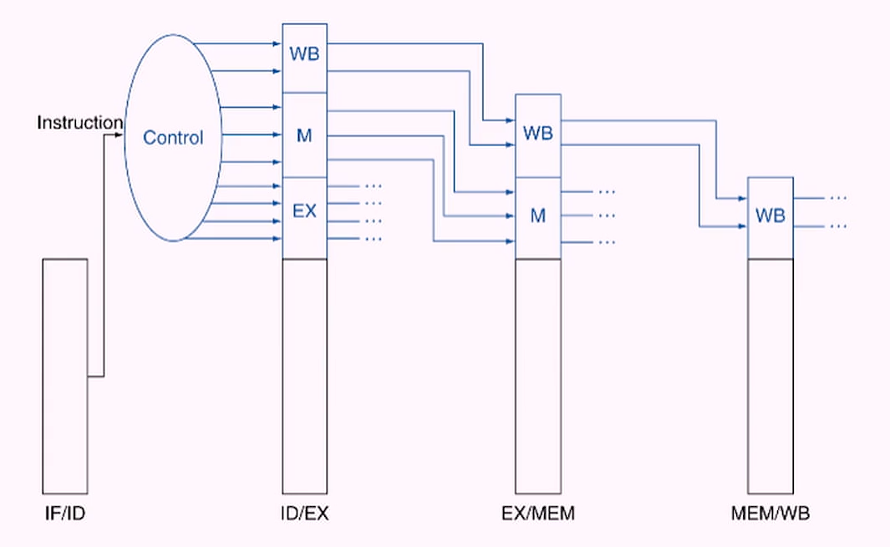

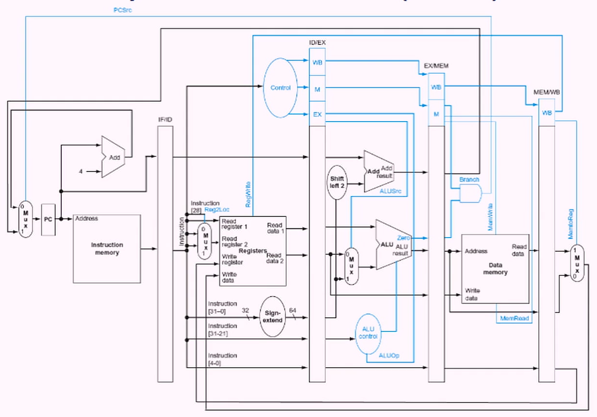

### Conclusions

- Building blocks
  - computation, communication, storage
- logic design
  - gates, flip flops, latches, clock
- datapath
  - register, memory, branch operations
- implementation
  - execution cycle: Fetch, Decode, operands, execute, store, next
- an overview of pipelining
  - overlapping instructions to improve throughput
  - structural, data, control hazards

## Live Session

### Instruction Set Architecture

- instruction is a command that the hardware can understand
  - fields - partitions, places, segments
    - opcode, destination, source1, source2
    - add R1, R2, R3

- instruction set is intermediate player between hardware and software

#### Taxonom of ISA
- stack: both operands are implicit on the top of the stack, last in first out
- accumulator: one operand is implicit in the accumulator, a special-purpose register
- general purpose register

#### Instruction Set Principles
- most of the instructions are implied
- accumulator - special purpose regulator

- stack
  - push A
  - push B
  - Add
  - pop C
- accumulator
  - load A
  - load B
  - load C
- register memory
  - 

Our course is reg-reg/load-store
  - load: copy data from memory into register
  - store: copy data from register into memory

Reduced Instruction Set Computer (RISC)

LW R1, oR2

- load means you take a copy of the data and place it into R1

LW R5, 10(R3)
- load word into R5 from 10+R3

SW R1, 5(52)
- store word from R1 into 5+R2

- all instruction are 32-bits
  

#### Memory Addressing
- ordering bytes within a larger object: assume 4 bytes in a words
  - little endian from the left
  - big endian from the right

#### branch

- branch if carrier is carried
- branch if carrier is set
- branch if greater than
- branch if less than

#### Immediate or Literal Access Mode
- use of immediate
- use of direct

#### Instruction Format

- I type
  - immediate
- R type
  - arithmetic
- J type
  - Jump or Branch
  - relative to the program counter (PC)

- 32 bit instructions
  - six bits is always the opcode

#### group instruction project

- add, subtract, multiply, divide
- jump? branch?
- RISC V
  - 

