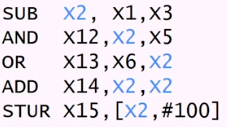

# Week 3 Advanced Pipelining and I/O
## Table of Contents
- [Week 1 Fundamentals of Quantitative Design and Analysis](../week1/README.md)
- [Week 2 Processor Design](../week2/README.md)
- **&rarr;[Week 3 Advanced Pipelining and I/O](README.md)**
- [Week 4 Memory Hierarchy Design](../week4/README.md)
- [Week 5 Instruction-Level Parallelism (ILP)](../week5/README.md)
- [Week 6 Vector and GPU Architectures (DLP)](../week6/README.md)
- [Week 7 Multithreaded and Multicore Processors (Thread-Level Parallelism)](../week7/README.md)
- [Week 8 Shared-Memory Systems (Data-Level Parallelism)](../week8/README.md)
- [Week 9 Interconnection Networks](../week9/README.md)
- [Week 10 Request-Level Parallelism](../week10/README.md)

### Data Hazards

#### Data Hazards in ALU Instructions

consider this sequence

- we can resolve hazards with forwarding
  - how do we detect when to forward

#### Dependencies and Forwarding

#### Datapath with Forwarding

#### How to Stall the Pipeline
- force control values ID/EX register to 0
  - EX, MEM and WB do nop (no-operation)
- Prevent update of PC and IF/ID register
  - using instruction is decoded again
  - following instruction is fetched again
  - one-cycle stall allows MEM to read data for LDUI
    - can subsequently forward to EX stage

#### Load-Use Data Hazard

#### Datapath with Hazard Detection

#### Stalls and Performance

- stalls reduce performance
  - but are required to get correct results

- compiler can arrange code to avoid hazards and stalls
  - requires knowledge of the pipeline structure

* ideal cycle per instruction is 1

### Control Hazards

#### Branch Hazards

- if branch outcome determined in MEM
  - conditional, new instructions

#### Reducing Branch Delay

- move hardware to determine outcome to ID stage
  - ta

#### Dynamic Branch Prediction
- branch penalty can be significant for large systems
- use dynamic prediction
  - branch prediction buffer (branch history table)
  - indexed by recent branch instruction address
  - stores outcome (taken/not taken)
  - to execute a branch
    - check table, expect the same outcome
    - start fetching from fall-through or target
    - if wrong, flush pipeline and flip prediction

#### one-bit predictor: shortcoming

#### Two-bit predictor

- only change prediction on two successive mispredictions

#### Calculating the Branch Target

- even with predictor, still need to calculate the target address
  - one cycle penalty for a taken branch
- branch target buffer
  - cache of target addresses
  - indexed by PC when instruction fetched
    - if hit and instruction is branch predicted taken, can fetch target immediately

### Exceptions

#### Exceptions and interrupts

- unexpected events requiring change in flow of control
  - different ISAs use the terms differently
- exception
  - arises within the CPU
- Interrupt
  - from and external I/O controller
- dealing with them without sacrificing performance is hard

#### Handling Exceptions

- save PC of offending (or interrupted instruction)
  - in Av8 exception link register (ELR)
- Save indication of the problem
  - in AV8: exception syndrome register (ESR)
  - we'll assume one-bit
    - 0 for undefined opcode, 1 for overflow

#### Handler actions
- read cause and transfer to relevant handler
- determine action required

#### Exceptions in a Pipeline
- another form of control hazard

#### Exception properties

-restartable exceptions
  - pipeline can flush to instruction
  - handler executes then returns instruction
- PC saved in ELR register
  - identifies causing instruction
  - actually PC+4 is saved

#### Exception example

#### Multiple Exceptions

#### imprecise exceptions

### Parallelism via Instructions

#### Instruction-Level Parallelism

- pipelining: executing multiple instructions in parallel
- to increase ILP
  - deeper pipeline
    - less work per stage -> shorter clock cycle
  - multiple issue

#### Multiple Issue

- static multiple issue
  - compiler groups instructions to be issued together
  - packages them into "issue slots"
  - compiler detects and avoids hazards
- dynamic multiple issue
  - CPU examines instruction stream and chooses instructions to issue each cycle
  - compiler can help by reordering instructions
  - CPU resolves hazards using advanced techniques at runtime

### I/O System Characteristics

#### Introduction to I/O

- I/O devices can be characterized by
  - behavior
  - partner
  - data rate
- I/O bus connections

#### I/O System Characteristics

- dependability is important
- performance measures
  - latency
  - throughput
  - desktops and embedded systems
  - servers

#### Dependability

- fault: a failure of a component
- may or may not lead to system failure

#### Dependability Measures

- reliability: mean time to failure
- service interruption: mean time to repair
- mean time between failures
  - MTBF=MTTF+MTTR
- availability=MTTF/(MTTF+MTTR)
  - increasing MTTF: fault avoidance, fault tolerance, fault forecasting
  - reduce MTTR: improved tools and processes for diagnosis and repair

#### Interconnecting Components

- Need interconnections between
  - CPU, memory, I/O controllers
- Bus: shared communication channel
  - Parallel set of wires for data and synchronization of data transfer
  - Can become a bottleneck
- Performance limited by physical factors
  - Wire length, number of connections
- More recent alternative: high-speed serial connections with switches
- Like networks

#### Bus Types

- processor-memory buses
  - short high-speed
  - design is matched to memory organization
- I/O buses
  - longer allowing multiple connections
  - specified by standards for interoperability
  - connect to processor memory bus through bridge
  
### Interconnecting Components

- need interconnections between
  - CPU, memory , IO controllers
- bus: share communication channel
  - parallel set of wires for data synchronization of data transfer
  - bottleneck
- performance limited by physical factors
- alternative: high-speed serial connections with switches

#### Bus Types
- processor-memory buses
  - short high-speed
  - design is matched to memory organization
- IO buses
  - longer, allowing multiple connections
  - specified by standards for interoperability
  - connect to processor memory bus through a bridge

> bus wires can act as antennas, something to watch out for

#### Bus signals and synchronization

- data lines
- control lines
- synchronous
- asynchronous

#### IO managements

- IO is mediated by the OS
  - resource protection and scheduling
- IO causes asynchronous interrups
  - exceptions
- IO programming is fiddly
  - OS provides abstractions to programs

#### IO commands

- IO managed by IO controller hardware
- command registers
- status registers
- data registers

#### IO Register Maping

- Memory mapped IO
- IO Instructions
  - separate instructions

#### Polling
- periodically check 

#### Interrupt

- when a device is ready or error occurs

#### IO Data Transfter
- polling and interrupt-driven IO
  - CPU transfers data between memory and IO 

- direct memory access DMA

#### DMA Cache interaction

- cache

#### DMA/VM Interaction

- virtual memory

#### Measuring IO performance

- hardware, memory, controllers, busses
- OS, database

### Parallelism and IO

IO is slow, CPU is fast

#### RAID

- redundant array of inexpensive (independent) disks

> large number of small disks vs small number of large disks

- generally large number of small disks

#### RAID Summary

- RAID can improve performance and availability.
  - High availability requires hot swapping.
- Assumes independent disk failures.
  - Too bad if the building burns down!

### IO System Design

- satisfy latency requirements
- maximize throughput

- if system is loaded, simple analysis is insufficient
  - need to use queuing models or simulation

#### Server  Computers

- large datacenters
  - space and power constraints

### Conclusion

- Hazards: structural, data, control
- Exception handling
- CPI<1: parallelism via instructions
- Implementations: ARM vs. Intel
- I/O: latency, throughput
- Storage: disk, flash drive, RAID
- Buses: parallel, serial
- Control: interruptions, polling

## Live Session

### pipelining: Its Natural

- laundry example

### Pipelining

- multiple instructions are overlapped

### implementation of RISC instructions

1. instruction fetch cycle (IF)
   - instructions are in the memory
   - put in the IR - instruction register

2. decode instruction
   - decode the instruction and read registers
   - find the operands
3. execution/effective address cycle *EX
   - the alu operates on the operands and perform on of 3 functions
   - ouput of ALU is the answer
4. memory access
   - if load, memory does a read 

5. 
   - if store, put the value in a register

if DMem and Ifetch access the same memory, we get a hazard
  - assume separate instruction and data memory

IF
ID
EX
MEM
WB

Having less instructions is beneficial up to a point, where you eventually need pipelining

40+10+50 40+10+50

40+1+10+1+50+1
     40+1+10+1+50+1

(1/1.05)
(1.05)

1 (.4)
1.05 

- Example:
-- Machine 1: separate I, D (no structure hazards)
-- Machine 2: with structure hazard (unified I, D):
clock rate 1/1.05 of machine 1
-- 40% of instructions are data accesses
which is faster??? Assume pipeline stall overhead=1

avg inst time 1 =1*clock cycle time
ave inst time 2 =1+0.4*1*clock cycle time/1.05=1.3

### Data Hazards

- occurs because pipelining changes the order of read/write accessses to operands

- Occurs because pipelining changes the
order of read/write accesses to operands
1. DADD R1, R2, R3
2. DSUB R4, R1,R5
3. AND R6, R1,R7
4. OR R8, R1,R9
5. XOR R10, R1,R11

- FDXMW
- when and where R1 available for instruction 1
  - middle of W
- when and where R1 needed for instruction 2
  - middle of D
- is an arrow from W to D forward or backward?

> we always fetch the instructions under the decode of the previous instruction

FDX|MW
 FD|XMW

LW R1, 0(R2)
SUB R4, R1, R5
AND R6, R1, R7
OR R8, R1, R9

FDXM|W
 FDS|XMW
  FSDXMW

3 solutions to data hazards
- stall cycles
- forwarding with stall cycles
- out of order execution
  

### Control Hazards

solutions
- stall cycles
- prediction
- guess
- delayed branch

SW R0 0(R1)
LW R2 0(R1)

FDXMW|
 FSSS|DXMW

LW  R1, 0(R2)
SUB R3, R4, R5
ADD R6, R1, R2

FDXMW
 FDXMW
  FSDXMW