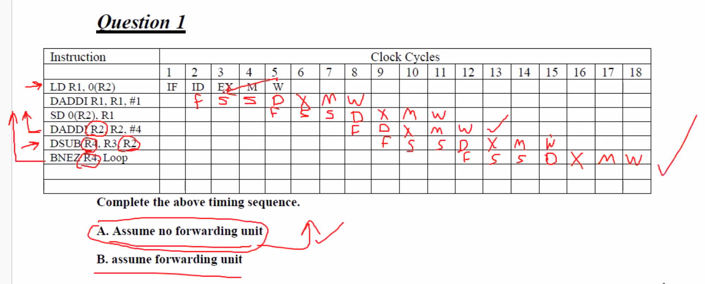
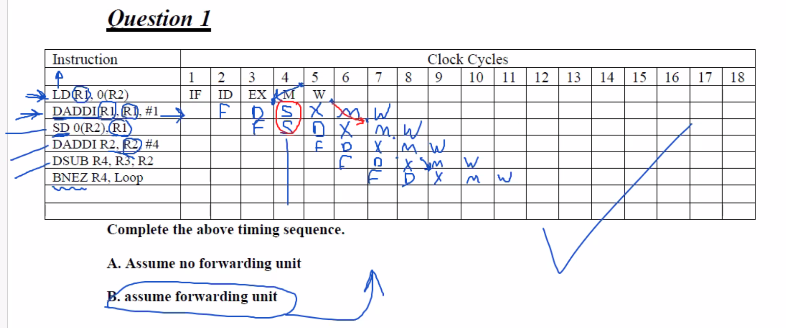

# Week 5 Instruction-Level Parallelism (ILP)
## Table of Contents
- [Week 1 Fundamentals of Quantitative Design and Analysis](../week1/README.md)
- [Week 2 Processor Design](../week2/README.md)
- [Week 3 Advanced Pipelining and I/O](../week3/README.md)
- [Week 4 Memory Hierarchy Design](../week4/README.md)
- **&rarr;[Week 5 Instruction-Level Parallelism (ILP)](README.md)**
- [Week 6 Vector and GPU Architectures (DLP)](../week6/README.md)
- [Week 7 Multithreaded and Multicore Processors (Thread-Level Parallelism)](../week7/README.md)
- [Week 8 Shared-Memory Systems (Data-Level Parallelism)](../week8/README.md)
- [Week 9 Interconnection Networks](../week9/README.md)
- [Week 10 Request-Level Parallelism](../week10/README.md)


## Live Session

hw 3 q 1 answer

assume no forwarding unit



assume forwarding unit



#### Pipelining Review

- ideal CPI
- structural hazards
  - access the same hardware at the same time
- data hazards
  - instruction is awaiting the output of a previous instruction
    - busy waiting - do something out of order
- control hazards
  - have to fetch when branching
    - guess
    - predictive

#### Instruction level parallelism

- loop-level parallelism to exploit parallelism among iterations of a loop:
```
for (i=1;i<1000;i++){
x[i]=x[i]+y[i]
}
```

- unrolling can give you more tools in loops

#### Data dependence and hazards

- read after write there is a potential hazard
- write after read hazard

#### Data unrolling

- unrolling is important to increase the number of tools available
- decrease the number of stalls from getting data from memory

#### Midterm

- exam is everything up to now
- exam is open everything


### Group
show instruction, show operations
examples of operations, show memory

### Code describe the parser, decoder, alu

4. What is the pipelining timing diagram FDXMW for the following program using no forwarding unit and using forwarding unit?
1)
Add R1, R2, R3
BNEZ R1, LL

No forwarding unit:
F D X M W|
  F D S S|X M W

F D X|M W
  F D|X M W

2)
SW R0, 0 (R1)
Add R2, R3, R1

F D X M W
  F D X M W

write after write

####HW 3
- no forwarding unit

| Instruction        | 1 | 2 | 3 | 4 | 5 | 6 | 7 | 8 | 9 | 10 | 11 | 12 | 13 | 14 | 15 | 16 | 17 | 18 |
|--------------------|---|---|---|---|---|---|---|---|---|----|----|----|----|----|----|----|----|----|
| LD R1, 0(R2)       | F | D | X | M |aWa|   |   |   |   |    |    |    |    |    |    |    |    |    |
| DADDI R1, R1, #1   |   | F | S | S |aDa| X |bMb| W |   |   |   |    |    |    |    |    |    |    |    |    |
| SD 0(R2), R1       |   |   |   |   | F | S | S |bDb| X | M | W |   |   |    |    |    |    |    |    |    |    |    |
| DADDI R2, R2, #4   |   |   |   |   |   |   |   | F | D | X | M | W |   |    |    |    |    |    |    |    |    |    |
| DSUB R4, R3, R2    |   |   |   |   |   |    |   |   | F | D | X | M | W |    |    |    |    |    |    |    |    |    |
| BNEZ R4, Loop      |   |   |   |   |   |   |   |   |    | F | D | X | M | W  |    |    |    |    |    |    |    |    |
